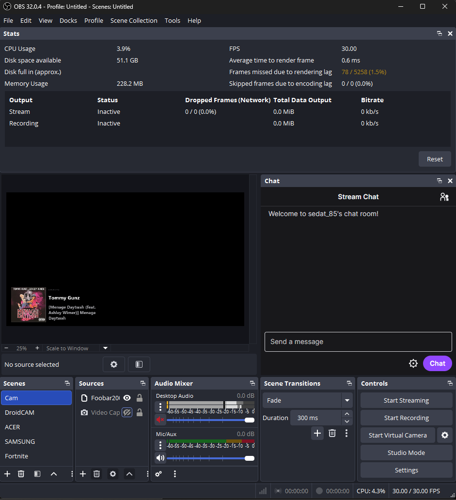

# foobar2000 Now Playing

An [OBS Studio](https://obsproject.com/) plugin that displays the currently playing track from foobar2000 as an overlay source.



## Features

- Shows artist name, track title, and album art from foobar2000
- Album art extracted from audio files via Windows Shell API
- Built-in background and overall opacity controls
- Customizable text colors for label, artist, and title
- Transparent background — blends over any scene
- Clears the display when playback stops or foobar2000 is closed

## How it works

The plugin consists of two parts:

1. **OBS plugin** (`foobar2000-obs.dll`) — reads track info from the foobar2000 window title and album art from the current file
2. **foobar2000 component** (`foo_obsbridge.dll`) — writes the current playing file path to a bridge file at `%LOCALAPPDATA%\foobar2000-obs\bridge.txt`

Every second, the plugin reads the foobar2000 window title via `EnumWindows` to get artist and track name, then reads the bridge file to get the file path for album art extraction.

The overlay is rendered with GDI+ into a 750x300 pixel bitmap, converted to an OBS texture, and drawn as a sprite.

## Requirements

- **OBS Studio** >= 31.1.1
- **foobar2000** v2.x running on the same machine
- **Windows** 10 or later (x64)

## Installation

### Option 1 — EXE Installer (recommended)

[Download `foobar2000-obs-installer.exe`](https://github.com/eaeoz/foobar2000-obs/releases/download/2.0.0/foobar2000-obs-installer.exe)

Run the installer. It automatically detects both OBS Studio and foobar2000 directories and copies all files to the correct locations:

> **Note:** The installer auto-detects your OBS Studio and foobar2000 installation paths. You do not need to change them unless you are installing to a custom or portable location for future use.

| File | Destination |
|------|-------------|
| `foobar2000-obs.dll` | `{OBS}\obs-plugins\64bit\` |
| `foobar2000-obs.pdb` | `{OBS}\obs-plugins\64bit\` |
| `locale\en-US.ini` | `{OBS}\data\obs-plugins\foobar2000-obs\locale\` |
| `foo_obsbridge.dll` | `{foobar2000}\components\` |

### Option 2 — Manual ZIP

[Download `foobar2000-obs.zip`](https://github.com/eaeoz/foobar2000-obs/releases/download/2.0.0/foobar2000-obs.zip)

The ZIP contains two components:

```
# OBS Plugin
foobar2000-obs.dll
foobar2000-obs.pdb
foobar2000-obs/
  locale/
    en-US.ini

# foobar2000 Bridge Component
foo_obsbridge.dll
```

**Install the OBS plugin:**

1. Copy `foobar2000-obs.dll` and `foobar2000-obs.pdb` to `{OBS_DIR}\obs-plugins\64bit\`
2. Copy the `foobar2000-obs` folder to `{OBS_DIR}\data\obs-plugins\`  
   (result: `{OBS_DIR}\data\obs-plugins\foobar2000-obs\locale\en-US.ini`)
3. Restart OBS Studio

**Install the foobar2000 bridge component:**

1. Copy `foo_obsbridge.dll` to your foobar2000 `components` folder  
   (default: `C:\Users\{you}\AppData\Roaming\foobar2000\components\`)
2. Restart foobar2000

## Usage

1. Make sure both OBS Studio and foobar2000 are running
2. In OBS, add a new **Source** -> **foobar2000 Now Playing** to your scene
3. Start playback in foobar2000 — the overlay updates automatically

### Source Settings

| Setting | Description |
|---------|-------------|
| **Opacity** | Overall transparency (0-100%) |
| **Background Opacity** | Background darkness (0-100%, default 70%) |
| **Label Color** | Color of the "NOW PLAYING" text |
| **Artist Color** | Color of the artist name |
| **Title Color** | Color of the track title |
| **Reset Defaults** | Restores all settings to defaults |

The overlay is 750x300 px. Scale or position it as needed in your scene.

## Development

### Prerequisites

- **Visual Studio 2022** or later with **Desktop development with C++** workload
- **CMake** >= 3.28 (bundled with Visual Studio)
- **foobar2000 SDK** (fetched automatically by CMake)
- **Git**

### Build

```powershell
cmake --preset windows-x64
cmake --build --preset windows-x64
```

This builds both the OBS plugin and the foobar2000 bridge component.

- OBS plugin: `build_x64/RelWithDebInfo/foobar2000-obs.dll`
- Bridge component: `build_x64/out/foo_obsbridge.dll`

### Build installer

```powershell
.\build-all.bat
```

This builds both components and creates `foobar2000-obs-installer.exe` using NSIS.

## License

GNU General Public License v2.0. See [LICENSE](LICENSE).
