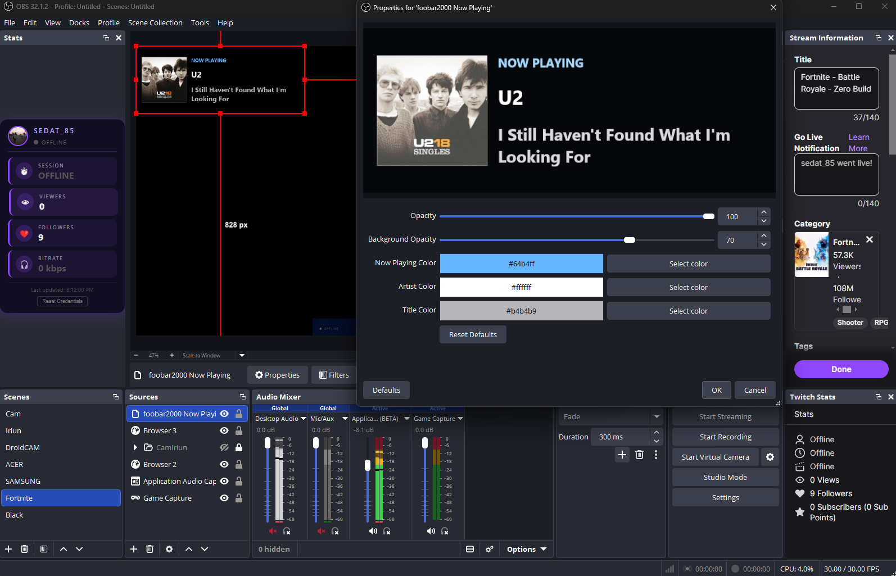

# foobar2000 Now Playing

An [OBS Studio](https://obsproject.com/) plugin that shows what's currently playing in foobar2000 as an overlay.



## What it does

Reads the artist and title from foobar2000's window title, extracts album art from the playing file, and renders everything into a single overlay source. Comes with a small foobar2000 component that passes the file path to OBS.

## Features

- Artist name, track title, and album art
- Background and overall opacity sliders
- Color pickers for each text element
- Clears when playback stops or foobar2000 is closed

## Requirements

- OBS Studio 31.1.1+
- foobar2000 v2.x
- Windows 10+ (x64)

## Installation

### Option 1 — EXE Installer (recommended)

[Download `foobar2000-obs-installer.exe`](https://github.com/eaeoz/foobar2000-obs/releases/download/2.0.0/foobar2000-obs-installer.exe)

Run it. It detects OBS and foobar2000 paths automatically and copies everything to the right places.

> The installer auto-detects your paths. No need to change them unless you have a custom or portable setup.

| File | Destination |
|------|-------------|
| `foobar2000-obs.dll` | `{OBS}\obs-plugins\64bit\` |
| `foobar2000-obs.pdb` | `{OBS}\obs-plugins\64bit\` |
| `locale\en-US.ini` | `{OBS}\data\obs-plugins\foobar2000-obs\locale\` |
| `foo_obsbridge.dll` | `{foobar2000}\components\` |

### Option 2 — Manual ZIP

[Download `foobar2000-obs.zip`](https://github.com/eaeoz/foobar2000-obs/releases/download/2.0.0/foobar2000-obs.zip)

The ZIP contains two components:

```
# OBS Plugin
foobar2000-obs.dll
foobar2000-obs.pdb
foobar2000-obs/
  locale/
    en-US.ini

# foobar2000 Bridge Component
foo_obsbridge.dll
```

**OBS plugin:**

1. Copy `foobar2000-obs.dll` and `foobar2000-obs.pdb` to `{OBS_DIR}\obs-plugins\64bit\`
2. Copy the `foobar2000-obs` folder to `{OBS_DIR}\data\obs-plugins\`
3. Restart OBS

**foobar2000 bridge component:**

1. Copy `foo_obsbridge.dll` to your foobar2000 `components` folder
   (default: `C:\Users\{you}\AppData\Roaming\foobar2000\components\`)
2. Restart foobar2000

## Usage

1. Both OBS and foobar2000 need to be running
2. In OBS, add **Source** -> **foobar2000 Now Playing** to your scene
3. Start playback in foobar2000 — overlay updates every second

### Source Settings

| Setting | Description |
|---------|-------------|
| **Opacity** | Overall transparency (0-100%) |
| **Background Opacity** | Background darkness (0-100%, default 70%) |
| **Label Color** | Color of the "NOW PLAYING" text |
| **Artist Color** | Color of the artist name |
| **Title Color** | Color of the track title |
| **Reset Defaults** | Restores all settings to defaults |

The overlay is 750x300 px. Scale or position as needed.

## Development

### Prerequisites

- Visual Studio 2022+ with **Desktop development with C++** workload
- CMake 3.28+ (bundled with Visual Studio)
- Git

### Main Output Targeted Files

- OBS plugin: `build_x64/RelWithDebInfo/foobar2000-obs.dll`
- Bridge component for foobar2000: `build_x64/out/foo_obsbridge.dll`

### Build installer

```powershell
.\build-all.bat
```

Builds both components and creates `foobar2000-obs-installer.exe`.

## License

GNU General Public License v2.0. See [LICENSE](LICENSE).
